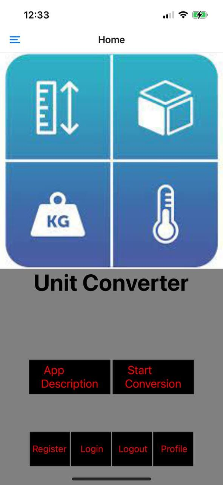
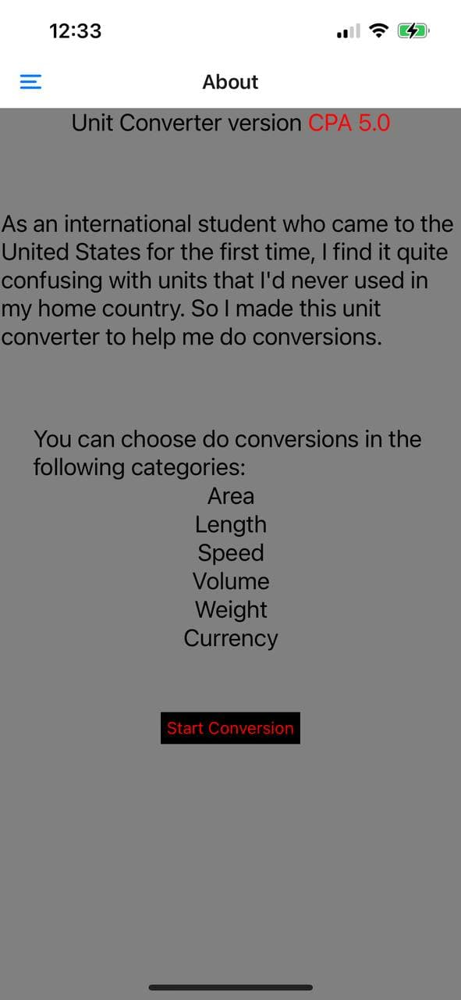
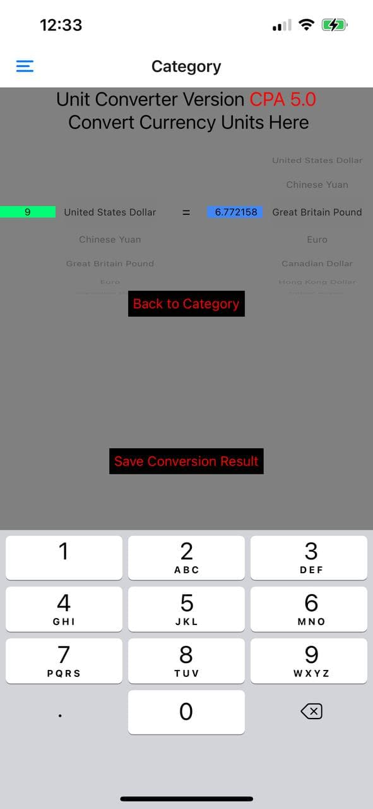

# Mobile-Development

## Description

This repo is used to hold my homework for the class CS153A Mobile Development. I upload the lastest version of my work to a latest CAPX(e.g. CAP1) branch, all history versions are located in other CAPX branches.

## Disclosure

All work in this repo is done solely by the owner of this repo. No other individuals should take advantage of work in this repo in any means.

## APP Name 
Unit Converter
## Version
Version 5.0
## Elevator Pitch 
This app is an unit converter that allows users to do conversion in six different categories(realtime exchange rate included), it also enables users to register an account, login to save and display their conversion histories. This app is based on React Native, it's server is built using Express and deployed on Heroku, it also utilizes MongoDB Atlas to store user information.
## Screen Shots

    
 

 
 

   

  

## Developer Notes

<figure>
    <figcaption style="font-weight:bold">Current Project Structure</figcaption>
    
</figure>

<figure>
    <figcaption style="font-weight:bold">Used Tools</figcaption>
    <ul>
        <li>React Native</li>
        <li>JavaScript</li>
        <li>AsyncStorage</li>
        <li>Axios</li>
        <li>Express</li>
        <li>MongoDB</li>
    </ul>
</figure>

<figure>
    <figcaption style="font-weight:bold">To be done</figcaption>
</figure>

- [X] Add database connection: MongoDB
- [X] Make the user profile page more user friendly
- [X] Make an Express server and deploy it to Heroku, server project link: https://github.com/yanxuanshaozhu/CPAServer